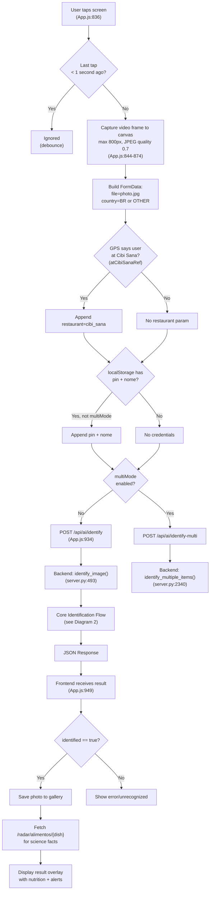
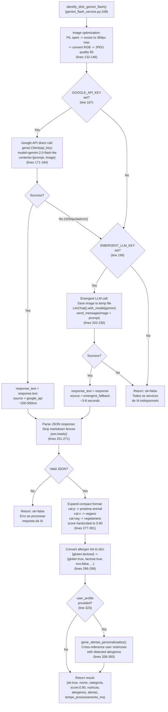
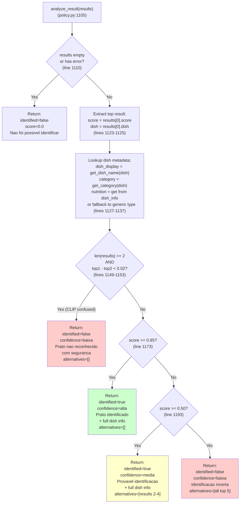
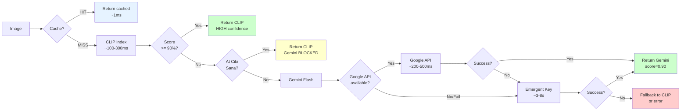
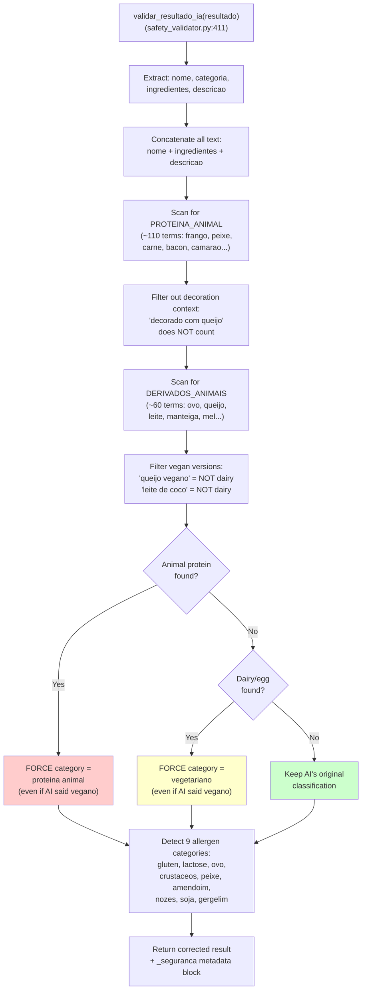
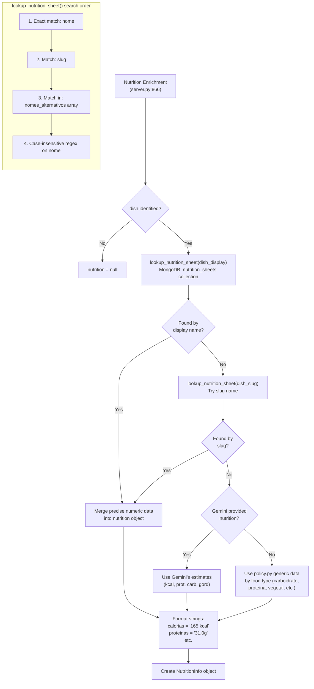
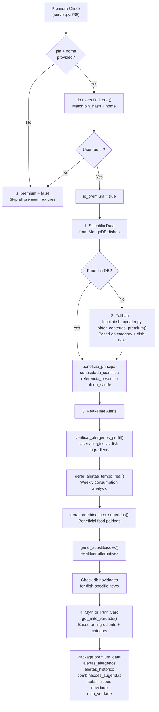

# SoulNutri - Food Scanning Core Logic: Mermaid Diagrams

## 1. Complete End-to-End Flow (Frontend to Backend to Response)

## 2. Core Backend Identification Logic (server.py:492-982)

This is the heart of the system - the cascading AI pipeline.

```mermaid
flowchart TD
    ENTRY["POST /api/ai/identify<br/>Params: file, pin, nome,<br/>country, restaurant<br/>(server.py:492)"] --> READ_IMG["Read image bytes<br/>(server.py:519)"]
    
    READ_IMG --> EMPTY{"Image empty?<br/>(server.py:521)"}
    EMPTY -->|Yes| ERR_EMPTY["Return: ok=false<br/>Arquivo de imagem vazio"]
    EMPTY -->|No| CACHE_CHECK

    subgraph CACHE ["STEP 1: Cache Check (server.py:533)"]
        CACHE_CHECK["get_cached_result(content)<br/>Key = MD5 of raw bytes"] --> CACHE_HIT{"Cache hit?"}
        CACHE_HIT -->|Yes| CACHE_RETURN["Return cached result<br/>+ source=xxx_cached<br/>~1-5ms"]
    end
    
    CACHE_HIT -->|No| CLIP_SEARCH

    subgraph CLIP ["STEP 2: CLIP Local Index (server.py:562-593)"]
        CLIP_SEARCH["index.search(content, top_k=5)<br/>Cosine similarity on 512-dim<br/>OpenCLIP ViT-B-32 embeddings<br/>(ai/index.py)"] --> ANALYZE["analyze_result(results)<br/>(ai/policy.py:1105)"]
        
        ANALYZE --> GAP_CHECK{"Top1 - Top2 < 0.02?<br/>(policy.py:1153)"}
        GAP_CHECK -->|"Yes (CLIP confused)"| CLIP_REJECT["identified=false<br/>score=low<br/>Prato nao reconhecido"]
        GAP_CHECK -->|No| SCORE_HIGH{"score >= 0.85?<br/>(policy.py:1173)"}
        
        SCORE_HIGH -->|Yes| CLIP_ALTA["identified=true<br/>confidence=alta<br/>+ nutrition, ingredients,<br/>benefits, risks"]
        SCORE_HIGH -->|No| SCORE_MED{"score >= 0.50?<br/>(policy.py:1193)"}
        
        SCORE_MED -->|Yes| CLIP_MEDIA["identified=true<br/>confidence=media<br/>+ up to 3 alternatives"]
        SCORE_MED -->|No| CLIP_BAIXA["identified=false<br/>confidence=baixa"]
    end
    
    CLIP_ALTA --> SERVER_SCORE{"server.py score >= 0.90?<br/>(server.py:578)"}
    CLIP_MEDIA --> SERVER_SCORE
    CLIP_BAIXA --> SERVER_SCORE
    CLIP_REJECT --> SERVER_SCORE
    
    SERVER_SCORE -->|"Yes (>= 0.90 & identified)"| ACCEPT_CLIP["decision = CLIP result<br/>source = local_index<br/>CLIP confiante - aceito"]
    
    SERVER_SCORE -->|No| IS_CIBI{"restaurant == cibi_sana?<br/>(server.py:584)"}
    
    IS_CIBI -->|Yes| CIBI_RESULT["decision = CLIP result<br/>source = local_index<br/>Gemini LOCKED<br/>Even if low confidence"]
    
    IS_CIBI -->|No| GEMINI_FLOW

    subgraph GEMINI ["STEP 3: Gemini Flash Fallback (server.py:598-659)"]
        GEMINI_FLOW["CLIP uncertain, not Cibi Sana<br/>Calling Gemini..."] --> GEMINI_AVAIL{"is_gemini_flash_available()?<br/>Checks EMERGENT_API_KEY<br/>or GOOGLE_API_KEY"}
        
        GEMINI_AVAIL -->|No| FALLBACK_CLIP{"CLIP index ready?"}
        FALLBACK_CLIP -->|Yes| USE_CLIP_ANYWAY["decision = CLIP result<br/>(even if low confidence)"]
        FALLBACK_CLIP -->|No| ERR_NO_AI["Return: ok=false<br/>Servico de IA indisponivel"]
        
        GEMINI_AVAIL -->|Yes| LOAD_PROFILE["Load user profile<br/>from MongoDB (if pin+nome)"]
        LOAD_PROFILE --> CALL_GEMINI["identify_dish_gemini_flash()<br/>(gemini_flash_service.py:108)"]
        
        CALL_GEMINI --> GEMINI_DETAIL["(see Diagram 3<br/>for Gemini internals)"]
        GEMINI_DETAIL --> GEMINI_OK{"result.ok == true?"}
        
        GEMINI_OK -->|Yes| ACCEPT_GEMINI["decision = Gemini result<br/>source = gemini_flash<br/>score = 0.90 (hardcoded)"]
        GEMINI_OK -->|No| GEMINI_FAIL{"CLIP index ready<br/>& has clip_decision?"}
        GEMINI_FAIL -->|Yes| USE_CLIP_FALLBACK["decision = CLIP result<br/>(graceful degradation)"]
        GEMINI_FAIL -->|No| ERR_BOTH_FAIL["Return: ok=false<br/>Nao foi possivel identificar"]
    end
    
    ACCEPT_CLIP --> CONFIDENCE
    CIBI_RESULT --> CONFIDENCE
    USE_CLIP_ANYWAY --> CONFIDENCE
    ACCEPT_GEMINI --> CONFIDENCE
    USE_CLIP_FALLBACK --> CONFIDENCE

    subgraph POSTPROCESS ["STEP 4: Post-Processing (server.py:661-968)"]
        CONFIDENCE["Apply confidence levels<br/>(server.py:664-687)"]
        CONFIDENCE --> CONF_HIGH{"score >= 0.90?"}
        CONF_HIGH -->|Yes| MSG_HIGH["confidence=alta<br/>Identificado: {name}<br/>0 alternatives"]
        CONF_HIGH -->|No| CONF_MED{"score >= 0.50?"}
        CONF_MED -->|Yes| MSG_MED["confidence=media<br/>Parece ser: {name}<br/>max 2 alternatives"]
        CONF_MED -->|No| MSG_LOW["confidence=baixa<br/>Nao foi possivel identificar<br/>0 alternatives"]
        
        MSG_HIGH --> ADMIN_SYNC
        MSG_MED --> ADMIN_SYNC
        MSG_LOW --> ADMIN_SYNC
        
        ADMIN_SYNC["Admin Name Sync<br/>Check MongoDB dishes<br/>for renamed dishes<br/>(server.py:693-721)"]
        
        ADMIN_SYNC --> IS_PREMIUM{"pin + nome provided<br/>AND user exists in DB?<br/>(server.py:738-745)"}
        
        IS_PREMIUM -->|No| NUTRITION
        IS_PREMIUM -->|Yes| SCIENTIFIC["Load scientific data<br/>1. MongoDB dishes collection<br/>2. Fallback: local_dish_updater.py<br/>(server.py:750-786)"]
        
        SCIENTIFIC --> ALERTS["Generate premium alerts:<br/>- Allergen alerts (profile)<br/>- History alerts (weekly)<br/>- Combination suggestions<br/>- Healthy substitutions<br/>- Novidades/news<br/>(server.py:791-837)"]
        
        ALERTS --> MITO["Myth or Truth card<br/>mitos_verdades.py<br/>(server.py:848-864)"]
        
        MITO --> NUTRITION
        
        NUTRITION["Enrich nutrition:<br/>1. lookup_nutrition_sheet(name)<br/>   from MongoDB nutrition_sheets<br/>2. Fallback: policy.py generic data<br/>(server.py:866-892)"]
        
        NUTRITION --> BUILD["Build response JSON<br/>~40 fields<br/>(server.py:901-946)"]
        
        BUILD --> CACHE_WRITE{"identified == true?<br/>(server.py:951)"}
        CACHE_WRITE -->|Yes| SAVE_CACHE["Cache result<br/>TTL = 1 hour"]
        CACHE_WRITE -->|No| SKIP_CACHE["Skip cache"]
        
        SAVE_CACHE --> METRICS
        SKIP_CACHE --> METRICS
        
        METRICS["Log processing metrics<br/>(if ENABLE_PROCESSING_METRICS)<br/>(server.py:957-967)"]
    end
    
    METRICS --> FINAL["Return JSON response<br/>(server.py:969)"]
```

## 3. Gemini Flash Service Internals (gemini_flash_service.py)

## 4. CLIP Policy Decision Logic (ai/policy.py:1105-1233)

## 5. Decision Cascade Summary (Simplified)

## 6. Safety Validation Flow (safety_validator.py)

Applied to every Gemini result before returning.

## 7. Nutrition Enrichment Flow (server.py:866-892)

## 8. Premium Enrichment Pipeline (server.py:731-864)

